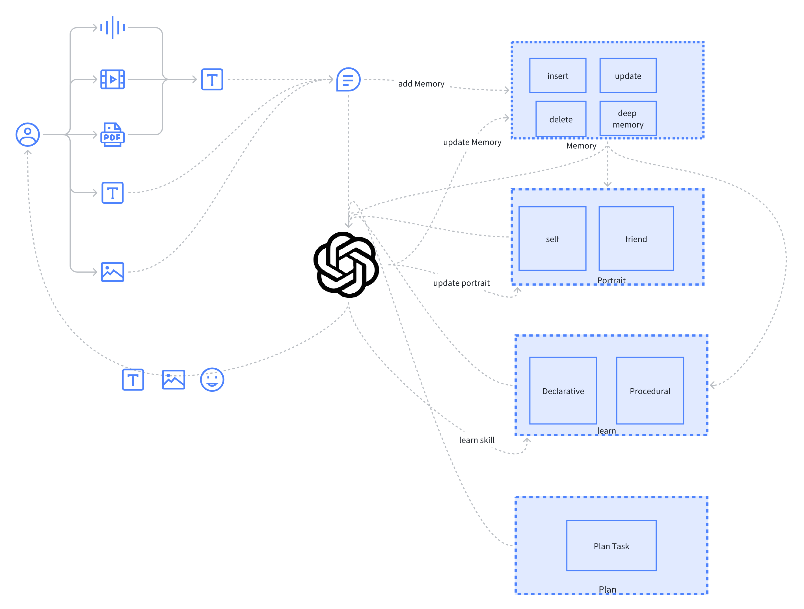

<p align="center">
        中文</a>&nbsp ｜ &nbsp<a href="README_EN.md">English</a>
</p>

---
# MEMORY-CHAT
## 一个名叫 Andrew 的聊天机器人，具备记忆、计划和学习的能力。
### 特别感谢 [Generative Agents](https://github.com/joonspk-research/generative_agents)，没有他们的帮助，这个项目就不会发生。
- 使用 OpenAI API 实现人工智能聊天，使用 SpringAi 作为 java 框架。
- 使用 itchat4j 代码实现微信作为聊天接口。
<p align="center">
    
<p>

## 启动
- 如果需要代理，JVM 启动参数：-Dhttps.proxyHost=127.0.0.1 -Dhttps.proxyPort=7890
- 将 template.yaml 文件复制为 application.ymal，修改配置，运行 Application 类。
- 等待项目启动后，扫描微信登录二维码，将登录的微信账号添加为好友，即可聊天。
### 必备
- 需要 Redis 来存储对话状态、对话缓存等数据。
- 需要 elasticsearch index:chat_memory 来保存内存。
- 需要图片床的 github 存储库访问令牌，或者你的自定义图床地址telegraph_url。
- 天气和 wolframalpha 密钥是可选的。
```json
    {
      "chat_memory": {
        "mappings": {
          "properties": {
            "aiResponseFlag": {
              "type": "keyword"
            },
            "chatMessage": {
              "type": "object"
            },
            "dealFileFlag": {
              "type": "boolean"
            },
            "emotion": {
              "type": "text",
              "fields": {
                "keyword": {
                  "type": "keyword",
                  "ignore_above": 256
                }
              }
            },
            "groupMsgFlag": {
              "type": "keyword"
            },
            "isDeleted": {
              "type": "text",
              "fields": {
                "keyword": {
                  "type": "keyword",
                  "ignore_above": 256
                }
              }
            },
            "memoryLeafDepth": {
              "type": "integer"
            },
            "messageContent": {
              "type": "text",
              "fields": {
                "keyword": {
                  "type": "keyword",
                  "ignore_above": 256
                }
              },
              "analyzer": "ik_max_word"
            },
            "messageContentType": {
              "type": "keyword"
            },
            "messageContentVector": {
              "type": "dense_vector",
              "dims": 1536
            },
            "messageCreateAt": {
              "type": "date",
              "format": "yyyy-MM-dd HH:mm:ss"
            },
            "messageCreatorId": {
              "type": "keyword"
            },
            "messageCreatorName": {
              "type": "keyword"
            },
            "messageCreatorType": {
              "type": "keyword"
            },
            "messageId": {
              "type": "keyword"
            },
            "messageImportanceScore": {
              "type": "double"
            },
            "messageLastAccessTime": {
              "type": "date",
              "format": "yyyy-MM-dd HH:mm:ss"
            },
            "messageOwnerId": {
              "type": "keyword"
            },
            "messageOwnerName": {
              "type": "keyword"
            },
            "messageOwnerType": {
              "type": "keyword"
            },
            "messageParentIds": {
              "type": "keyword"
            },
            "messageReceiveId": {
              "type": "keyword"
            },
            "messageReceiveName": {
              "type": "keyword"
            },
            "messageReceiveType": {
              "type": "keyword"
            },
            "realCreatorId": {
              "type": "keyword"
            },
            "realCreatorName": {
              "type": "keyword"
            },
            "summaryWords": {
              "type": "text",
              "fields": {
                "keyword": {
                  "type": "keyword",
                  "ignore_above": 256
                }
              }
            },
            "useToken": {
              "type": "integer"
            }
          }
        }
      }
    }
```


### 功能列表

- [x] 支持传入文件

- [x] 支持回复图片

- [x] 多条消息统一处理

- [x] 支持用户自定义系统消息

- [x] 支持AI决定是否回复，根据热点新闻发起消息

- [x] 指数退避检查是否发起消息

- [x] 支持视频消息回复

- [x] 支持网页搜索

- [x] 支持回复表情包

- [x] 支持接受好友请求

- [x] 规划时间计划、修改计划、修改个性、主动发起消息

- [x] 记忆更新逻辑、记忆组织、记忆淘汰

- [x] AI学习新技能并坚持

- [x] 个性化修改设置

- [x] 非陈述性记忆的学习和坚持

- [x] 更加口语化

- [x] 天气变化感知


